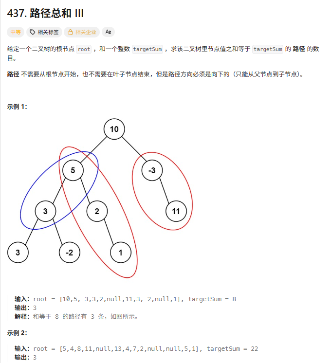
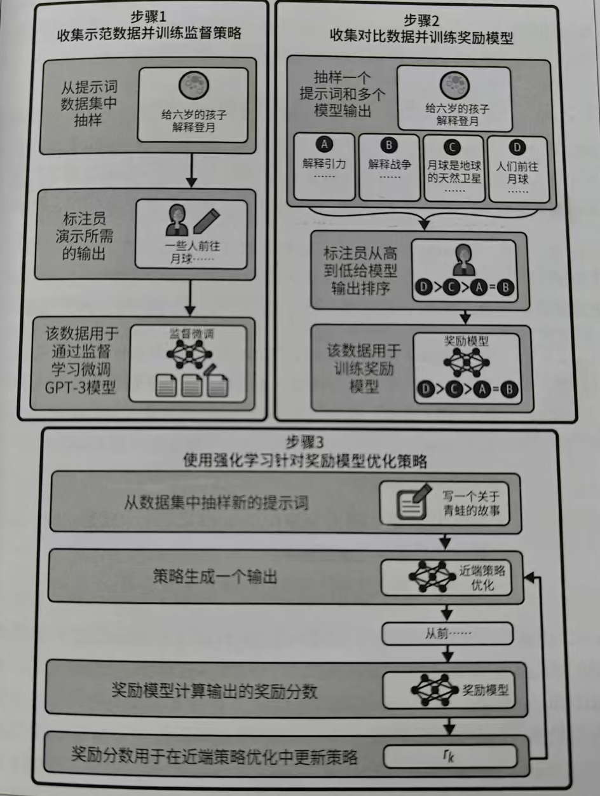

## 1、完成leetcode五道题



```
# Definition for a binary tree node.
# class TreeNode:
#     def __init__(self, val=0, left=None, right=None):
#         self.val = val
#         self.left = left
#         self.right = right
class Solution:
    def pathSum(self, root: Optional[TreeNode], targetSum: int) -> int:
        S=defaultdict(int) #前缀和数组 S[n]代表前缀和为n的个数
        S[0]=1             #以防只有一个值的树然后找不到路径
        res=0

        def dfs(node,ans):
            if not node:return
            nonlocal res
            ans+=node.val #目前节点到root的总和
            res+=S[ans-targetSum] #记录以当前节点为终点前面有多少个路径
            S[ans]+=1 #更新S前缀和数组
            dfs(node.left,ans)
            dfs(node.right,ans)
            S[ans]-=1 # 恢复现场（撤销 S[s] += 1）

        dfs(root,0)
        return res

```

重点：

    为什么递归参数 ans 不需要恢复现场？

    答：ans 是基本类型，在函数调用的时候会复制一份往下传递，ans += node.val 修改的仅仅是当前递归函数中的 ans 参数，并不会影响到其他递归函数中的 ans。注：如果把 ans 放在递归函数外，此时只有一个 ans，执行 ans += node.val 就会影响全局了，这种情况需要 ans -= node.val 恢复现场。

    为什么要初始化哈希表 S[0]=1？

    答：同 560 题，这里的 0 相当于前缀和数组中的 ans[0]=0。举个最简单的例子，根节点值为 1，targetSum=1。如果不把 0 加到哈希表中，按照我们的算法，没法算出这里有 1 条符合要求的路径。也可以这样理解，要想把任意路径和都表示成两个前缀和的差，必须添加一个 0，否则当路径是前缀时（从根节点开始的路径），没法减去一个数，具体见 前缀和及其扩展 中的讲解。


```
class Solution:
    def lowestCommonAncestor(self, root: 'TreeNode', p: 'TreeNode', q: 'TreeNode') -> 'TreeNode':
        if not root or root==p or root==q:return root
        left=self.lowestCommonAncestor(root.left,p,q)
        right=self.lowestCommonAncestor(root.right,p,q)
        if not left:return right
        if not right:return left
        return root

```

    设节点 root 为节点 p,q 的某公共祖先，若其左子节点 root.left 和右子节点 root.right 都不是 p,q 的公共祖先，则称 root 是 “最近的公共祖先” 。

        根据以上定义，若 root 是 p,q 的 最近公共祖先 ，则只可能为以下情况之一：

        p 和 q 在 root 的子树中，且分列 root 的 异侧（即分别在左、右子树中）；
        p=root ，且 q 在 root 的左或右子树中；
        q=root ，且 p 在 root 的左或右子树中；


    第一步：基层汇报（Base Case）
        这是每个主管最基本的逻辑：我这里是死胡同吗？（not root）：如果是，向上级汇报 None（我这儿啥也没找着）。我本人就是目标吗？（root == p or root == q）：如果我就是 $p$ 或者 $q$，我也要立刻向上级汇报我本人（我找着其中一个了！）。

    第二步：任务下达（Recursive Search）
        主管本人没找着，或者不是死胡同，于是他把任务派发给两个下属：
        left：左手边的下属去搜一圈，回来告诉我结果。
        right：右手边的下属去搜一圈，回来告诉我结果。
        注意： 这里体现了递归的“分治”思想。你不需要管下属是怎么搜的，你只需要等他们的最终报告。

    第三步：处理报告（Result Analysis）
        主管拿到两个下属的报告后，只有三种情况：
        情况 1：左边空手而归逻辑：左下属说“我这儿啥也没找着” (left is None)。决策：那结果肯定在右边。不管右边是找着了具体的节点，还是也为空，我都把右边的结果原封不动传给我的上级。
        情况 2：右边空手而归逻辑：右下属说“我这儿啥也没找着”。决策：同理，把左边的结果传给我的上级。
        情况 3：两边都有收获（高光时刻！）逻辑：左边找着了一个，右边也找着了一个。决策：天呐，我就是那个分叉点！ 说明 $p$ 和 $q$ 分别在我的左右子树里。我就是它们的“最近公共祖先”。于是，我把我自己向上汇报。


## 2、看完LLM应用开发书

    大模型的训练流程：预训练 - 监督微调（SFT） - 强化学习（RLHF）

    

    对于RLHF中问题的不同回答可以通过控制温度参数从而生成

    检索增强生成（RAG）：为模型添加知识库，从而更好地生成内容

    对于三种message：system、assistant、user
        1. system：系统信息，如："You are a helpful assistant"，不直接显示在用户对话框里
        2. assistant：助手消息，用来记忆上下文，代表模型之前的问题以及回答，你要重新喂给她
        3. user：用户消息，人类对话框里输入的文本
   
    很重要的两个参数：temperature和top_p
    temperature：控制模型输出的随机性，值越小回答越固定，值越大越随机。
    top_p采样：也称为核采样，表示llm考虑的token比例，比如0.5，就是只考虑50%的token，然后这50%里的token概率加和为1

    choices:模型响应的数组/对象
    total_tokens=prompt_tokens+completion_tokens:当n大于1时也就是要求多种输出，completion_tokens也会相应增多

    1、参数实现：response_format={type:"json_object"} 表示模型返回的格式为json对象 
    2、利用system message让模型将回答转为json对象

    LLM利用的工具Tool参数：
    1、type：只能设置为“fuction”
    2、name：工具名称
    3、description：工具描述，给大模型理解然后知道何时调用
    4、parameters：定义输入参数，使用json

    下面举个Tool例子：
        ```
            tools = [{
                "type": "function",
                "function": {
                    "name": "get_weather",           # 函数名
                    "description": "查询天气",        # 极其重要：模型靠它判断何时调用
                    "parameters": {                 # 参数描述
                        "type": "object",
                        "properties": {
                            "city": {"type": "string", "description": "城市名"},
                            "unit": {"type": "string", "enum": ["c", "f"]}
                        },
                        "required": ["city"]        # 必填参数
                    }
                }
            }]

        ``` 