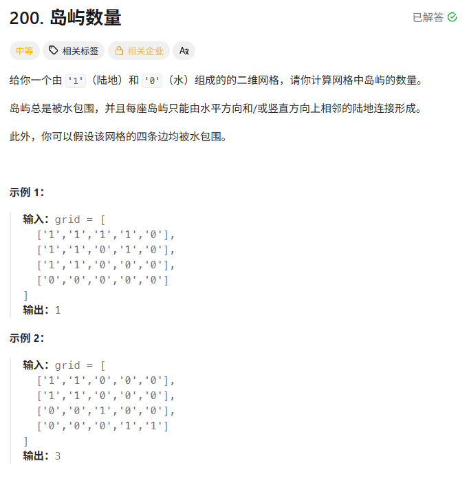
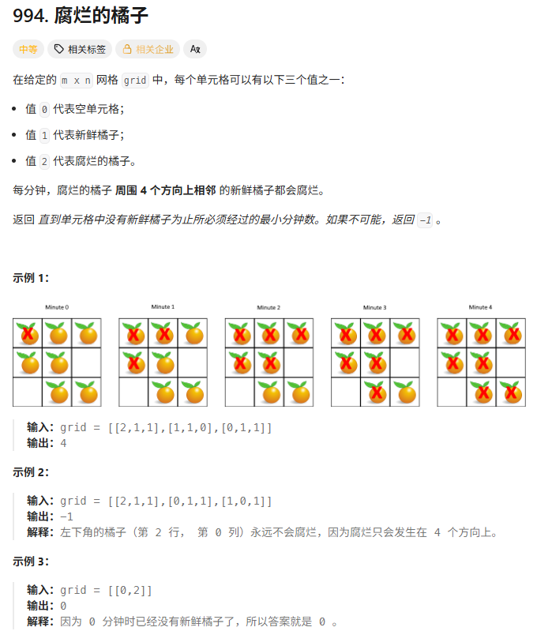

## 1、完成leetcode两道题



利用dfs递归来求解，大致思路就是遍历二维数组，每遇到一个为1的值就说明此处周围存在一个岛，那么从该点开始向四周dfs，并且对该岛周围的区域进行标记，递归出来就继续遍历下一个直到再次遇到1即另一个岛。


```
class Solution:
    def numIslands(self, grid: List[List[str]]) -> int:
        m, n = len(grid), len(grid[0])

        def dfs(i: int, j: int) -> None:
            # 出界，或者不是 '1'，就不再往下递归
            if i < 0 or i >= m or j < 0 or j >= n or grid[i][j] != '1':
                return
            grid[i][j] = '2'  # 插旗！避免来回横跳无限递归
            dfs(i, j - 1)  # 往左走
            dfs(i, j + 1)  # 往右走
            dfs(i - 1, j)  # 往上走
            dfs(i + 1, j)  # 往下走

        ans = 0
        for i, row in enumerate(grid):
            for j, c in enumerate(row):
                if c == '1':  # 找到了一个新的岛
                    dfs(i, j)  # 把这个岛插满旗子，这样后面遍历到的 '1' 一定是新的岛
                    ans += 1
        return ans
```



采用BFS来解决，对于第一种实现：
    首先用rooten和fresh两个集合来记录新鲜橘子和腐烂的橘子，然后使用BFS来遍历腐烂的橘子，并把腐烂的橘子周围的新鲜橘子腐烂掉，并rooten集合更新成新的一批传递后的烂橘子，然后重复这个过程，直到rooten集合为空。
    
    你BFS向四周走的时候，加入的烂橘子一定要选在fresh里的，不然可能就选到了之前批的起点橘子，就会无限循环，所以是
        if (i + di, j + dj) in fresh
    rooten直接更新为新一批的烂橘子，不保留原来的原因是起点橘子的使命已经完成了

```
class Solution:
    def orangesRotting(self, grid: List[List[int]]) -> int:
        row = len(grid)
        col = len(grid[0])
        rotten = {(i, j) for i in range(row) for j in range(col) if grid[i][j] == 2} # 腐烂集合
        fresh = {(i, j) for i in range(row) for j in range(col) if grid[i][j] == 1}  # 新鲜集合
        time = 0
        while fresh:
            if not rotten: return -1
            rotten = {(i + di, j + dj) for i, j in rotten for di, dj in [(0, 1), (0, -1), (1, 0), (-1, 0)] if (i + di, j + dj) in fresh} # 即将腐烂的如果在新鲜的集合中，就将它腐烂
            fresh -= rotten # 剔除腐烂的
            time += 1
        return time

```

队列实现

```
class Solution:
    def orangesRotting(self, grid: List[List[int]]) -> int:
        row,col=len(grid),len(grid[0])
        rotten=[(i,j,0) for i in range(row) for j in range(col) if grid[i][j]==2]
        fresh={(i,j) for i in range(row) for j in range(col) if grid[i][j]==1}
        # 2. 初始化队列：直接传入列表，deque 会把列表里的每个元组当成独立元素
        q = deque(rotten)
        time=0
        while q:
            i, j, time = q.popleft() # 取出一个腐烂橘子
            # 3. 逐个感染邻居
            for di, dj in [(1, 0), (-1, 0), (0, 1), (0, -1)]:
                ni, nj = i + di, j + dj
                if (ni, nj) in fresh:
                    fresh.remove((ni, nj)) # 立即从新鲜集合移除
                    q.append((ni, nj, time + 1)) # 单个元组入队
        return time if not fresh else -1
```


今天顺带整理了下python的list、set、deque的函数用法：

List
    函数,用法,说明,时间复杂度
    pop(),l.pop(),移除并返回最后一个元素。,O(1)
    pop(i),l.pop(i),移除并返回指定索引 i 的元素。,O(n)
    remove(x),l.remove(x),移除列表中第一个值为 x 的元素。若不存在则报错。,O(n)
    clear(),l.clear(),移除所有元素，清空列表。,O(n)
    del 语句,del l[i],物理删除指定索引或切片的元素。,O(n)

deque
    操作分类,方法,说明
    初始化,"dq = deque([1, 2, 3])",可以传入任何可迭代对象。
    右侧入队,dq.append(x),在末尾添加元素（最常用）。
    左侧入队,dq.appendleft(x),在头部添加元素。
    右侧出队,dq.pop(),弹出并返回末尾元素。
    左侧出队,dq.popleft(),弹出并返回头部元素（BFS 核心方法）。
    批量添加,"dq.extend([4, 5])",将列表中的元素逐个加到右侧。

set
    函数,用法,说明,时间复杂度
    remove(x),s.remove(x),移除值为 x 的元素。若 x 不存在会抛出 KeyError。,O(1) (平均)
    discard(x),s.discard(x),移除值为 x 的元素。若 x 不存在则静默跳过（更安全）。,O(1) (平均)
    pop(),s.pop(),随机移除并返回一个元素（因为集合无序）。,O(1)
    clear(),s.clear(),移除所有元素。,O(n)


## 2、了解旅游助手的初始入口代码

    什么是 Middleware（中间件）？
        中间件是在请求到达你的 API 端点之前或响应返回给客户端之后执行的代码。可以把它想象是一个"过滤器"或"处理器"，每个请求都要经过它。
        FastAPI中的add_middleware()方法可以添加中间件，比如日志、限流、认证、缓存等等。

    路由（Router）是 Web 开发的核心概念，路由的本质是一个映射关系，它告诉服务器：
        当用户访问某个 URL 路径时 → 应该执行哪个函数来处理

    ```
        # trip.py 文件中定义了路由
        @router.get("/trip/plan")
        async def plan_trip(request: TripPlanRequest):
            # 处理旅行规划请求
            return {"result": "行程规划结果"}

        # 通过 main.py 注册后
        # 用户访问：http://localhost:8000/api/trip/plan
        # 就会执行上面的 plan_trip 函数
    ```
    用户请求 → 路由 (接收 HTTP 请求) → Agent (处理业务逻辑) → 返回结果
           ↓                        ↓
      负责解析参数              负责调用 AI 模型
      负责返回响应              负责生成行程

    ```
        # 1️⃣ 路由层 (api/routes/trip.py) - 负责接收请求
        @router.post("/trip/plan")
        async def plan_trip(request: TripPlanRequest):
            # 2️⃣ 调用 Agent 来处理
            agent = TripPlannerAgent()
            result = await agent.plan(request)
            return result

        # 3️⃣ Agent 层 (agents/trip_planner_agent.py) - 负责业务逻辑
        class TripPlannerAgent:
            async def plan(self, request):
                # 调用 LLM、地图服务等
                # 生成旅行计划
                return plan_result

    ```


## 3、debug课题复现代码


# 